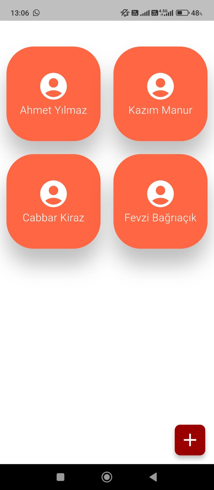
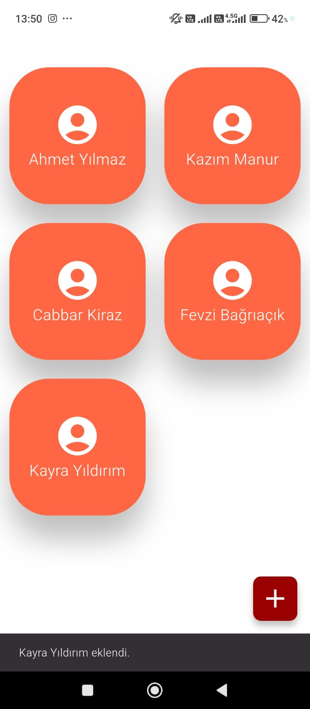
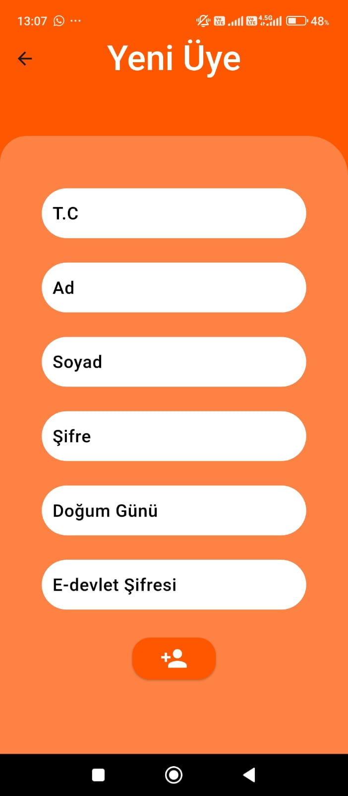
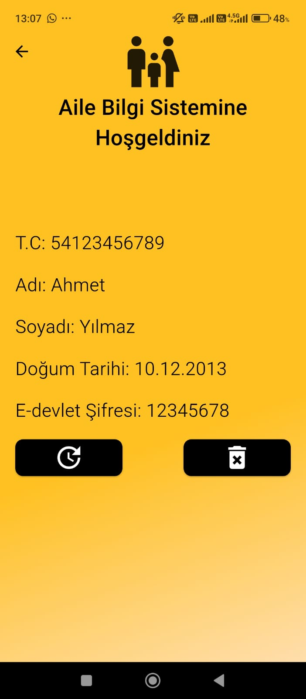
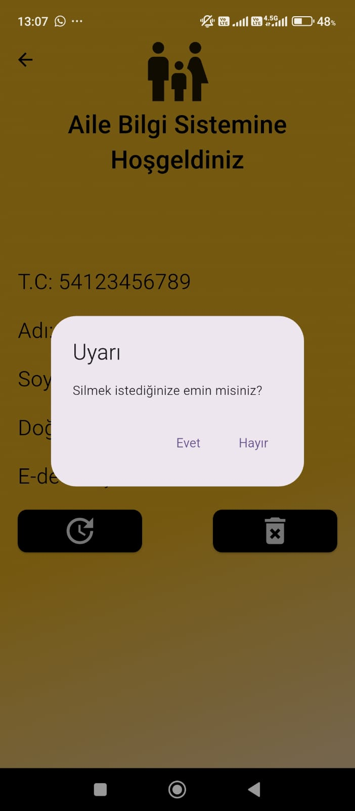
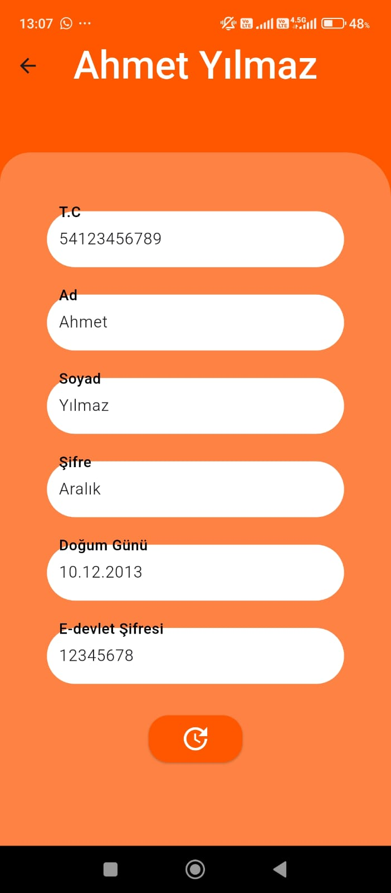
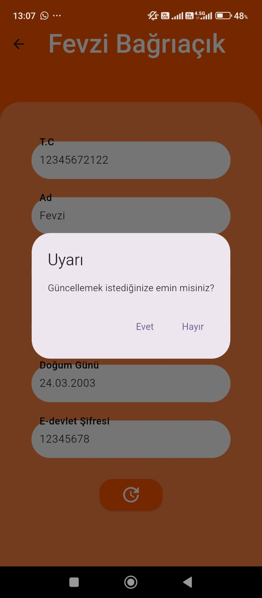
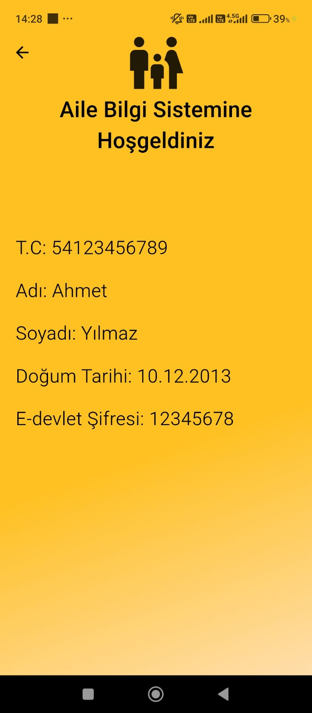

# Flutter Fisis Project

This project is a **comprehensive user management system** developed with **Flutter**.  
It allows normal users to view their own profiles, while admin users have **full control** over all users.  

Modern UI components, asynchronous data handling, and smooth navigation ensure an excellent user experience.

---

## 🇬🇧 English

### Features

- **Login System**: Users can log in with first name, last name, and birth month.  
- **Admin Login**: Entering `Fevzi / Bağrıaçık / 12345678` activates admin login.  
- **User Profile**: Normal users can view their own profile information.  
- **Admin Panel**:
  - All users are listed in a **GridView**.  
  - Tapping a user is handled with **GestureDetector**, directing to a detailed page.  
  - On the admin detailed page:
    - **Delete** user functionality available.  
    - **Update** user functionality redirects to a separate page.  
  - **FAB** allows navigation to add new users.  

### Database Management & Asynchronous Operations

- **DatabaseSupport**: Handles core database connection.  
- **PersonsDao**: Manages user data.  
- CRUD operations use **Future-based async functions**, keeping the UI responsive.

### UI / UX

- Modern and user-friendly interface.  
- GridView for organized user lists.  
- GestureDetector for interactive selections and navigation.  
- FAB for fast access and easy navigation.  

---

### User Scenario (Normal User)

1. Open the app and the **login screen** appears.  
2. Enter your first name, last name, and birth month.  
3. If the information is correct:
   - Login is successful.  
   - You are redirected to **your profile page**.  
   - Only your own information is visible.  
4. You cannot view or modify other users’ data.

> **Summary:** Normal users can only view and manage their own information.

---

### Admin Scenario (Administrator)

1. Enter admin credentials on the login screen:  
   - First Name: `Fevzi`  
   - Last Name: `Bağrıaçık`  
   - Password: `12345678`  
2. If login is successful, **Admin Panel** opens.  
3. In the admin panel:
   - View all users in a list.  
   - Tap a user:
     - A different detail page opens compared to normal users.  
     - On this page, you can **delete** or **update** the user.  
   - Navigate to add new users via **FAB**.  
   - After adding a user, return to the list and see the newly added user.

> **Summary:** Admin has full control over all users: view, delete, update, and add users.

---

### Technologies & Libraries

- Flutter & Dart  
- Material Design components  
- **DatabaseSupport**: database connection  
- **PersonsDao**: CRUD operations using Future/async functions  
- GridView, GestureDetector, FAB for interactive UI  
- StatefulWidget and setState for state management  

---

## 🇹🇷 Türkçe

### Özellikler

- **Login Sistemi**: Kullanıcı adı, soyadı ve doğum ayı ile giriş yapılır.  
- **Admin Girişi**: `Fevzi / Bağrıaçık / 12345678` bilgileri girildiğinde admin girişi aktif olur.  
- **Kullanıcı Profili**: Normal kullanıcılar kendi profil bilgilerini görebilir.  
- **Admin Paneli**:
  - Tüm kullanıcılar **GridView** ile listelenir.  
  - Kullanıcıya tıklama **GestureDetector** ile yakalanır ve detay sayfasına yönlendirilir.  
  - Admin detay sayfasında:
    - **Silme (Delete)** işlemi yapılabilir.  
    - **Güncelleme (Update)** işlemi için ayrı sayfaya geçiş yapılabilir.  
  - **Floating Action Button (FAB)** ile yeni kullanıcı ekleme sayfasına geçiş yapılabilir.  

### Veritabanı Yönetimi ve Asenkron İşleyiş

- **DatabaseSupport**: Uygulamanın çekirdek veritabanı bağlantısını sağlar.  
- **PersonsDao**: Kullanıcı verilerini yönetmek için tasarlanmıştır.  
- CRUD işlemleri **Future tabanlı async fonksiyonlar** ile gerçekleştirilir; UI bloklanmaz ve kullanıcı deneyimi kesintisiz olur.

### UI / UX

- Modern ve kullanıcı dostu arayüzler.  
- GridView ile düzenli kullanıcı listesi.  
- GestureDetector ile interaktif seçimler ve navigasyon.  
- FAB ile hızlı erişim ve kolay navigasyon.  

---

### Kullanıcı Senaryosu (Normal Kullanıcı)

1. Uygulamayı açtığında **giriş ekranı** görünür.  
2. Adını, soyadını ve doğduğun ayı girersin.  
3. Bilgiler doğruysa:
   - Giriş başarılı olur.  
   - **Kendi profil sayfana** yönlendirilirsin.  
   - Sadece kendi bilgilerini görebilir ve inceleyebilirsin.  
4. Başka kullanıcıların bilgilerini göremez veya değiştiremezsin.

> **Özet:** Normal kullanıcı sadece kendi bilgilerini görür ve kontrol eder.

---

### Admin Senaryosu (Yönetici)

1. Giriş ekranına admin bilgilerini girersin:  
   - Ad: `Fevzi`  
   - Soyad: `Bağrıaçık`  
   - Şifre: `12345678`  
2. Giriş başarılı olursa **Admin Paneli** açılır.  
3. Admin panelinde:
   - Tüm kullanıcıları liste halinde görürsün.  
   - Listeden bir kullanıcıya tıklarsın:
     - Normal kullanıcıların gördüğü sayfadan farklı bir detay sayfası açılır.  
     - Burada kullanıcıyı **silebilir (Delete)** veya **güncelleyebilirsin (Update)**.  
   - **FAB** ile yeni kullanıcı ekleme sayfasına geçebilirsin.  
   - Yeni kullanıcı ekledikten sonra listeye dönüp eklediğin kullanıcıyı görebilirsin.

> **Özet:** Admin, tüm kullanıcılar üzerinde tam yetkiye sahiptir: görebilir, silebilir, güncelleyebilir ve yeni kullanıcı ekleyebilir.

---

### Teknolojiler ve Kütüphaneler

- Flutter & Dart  
- Material Design bileşenleri  
- **DatabaseSupport**: veritabanı bağlantısı  
- **PersonsDao**: CRUD işlemleri için Future/async fonksiyonlar  
- GridView, GestureDetector, FAB ile interaktif UI  
- StatefulWidget ve setState ile state management  

---

## 📸 Screenshots

Below are the key screenshots of the application:

```markdown









